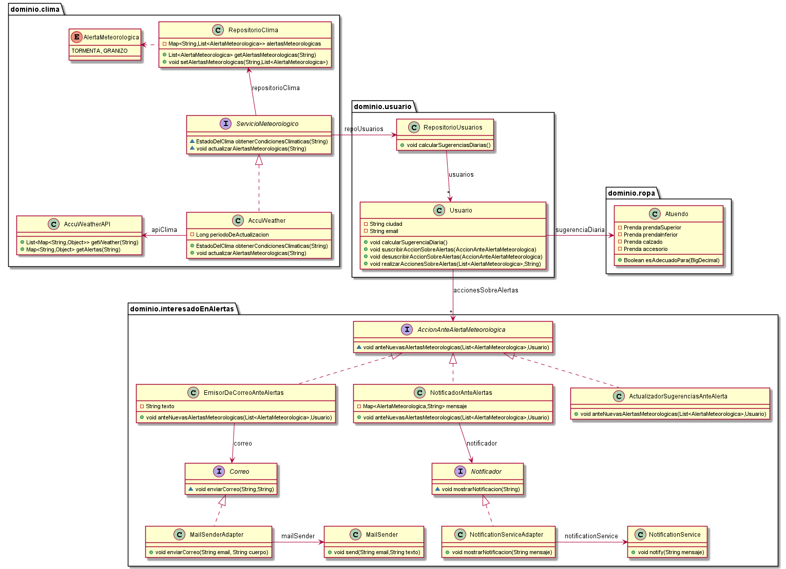
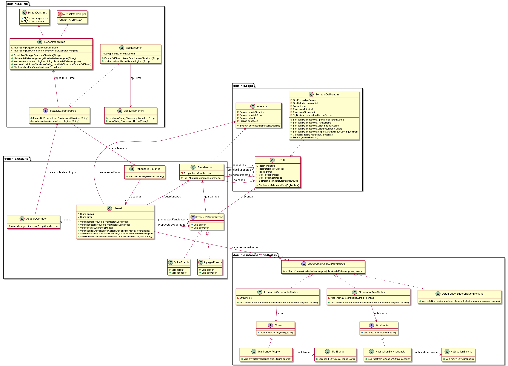

# QMP-Sexta-Iteracion

## Diagrama de clases - REQUERIMIENTOS DE ESTA ITERACION

<p align="center"> 

</p>

## Diagrama de clases - SOLUCION COMPLETA

<p align="center"> 

</p>


## Pseudocodigo

~~~

class Usuario {

  public void calcularSugerenciaDiaria() {
    this.sugerenciaDiaria = asesor.sugerirAtuendo( ciudad, guardarropas.get(random) );
  }

  public void suscribirAccionSobreAlertas(AccionAnteAlertaMeteorologica accion) {
    this.accionesSobreAlertas.add(accion);
  }

  public void desuscribirAccionSobreAlertas(AccionAnteAlertaMeteorologica accion) {
    this.accionesSobreAlertas.remove(accion);
  }

  public void realizarAccionesSobreAlertas(List<AlertaMeteorologica> alertas, String ciudad) {
    if (this.ciudad.equals(ciudad)) {
      this.accionesSobreAlertas.forEach( accion -> accion.anteNuevasAlertasMeteorologicas(alertas, this) );
    }
  }

}

public class RepositorioUsuarios {

  private List<Usuario> usuarios = new ArrayList<>();

  public void calcularSugerenciasDiarias() {
    usuarios.forEach(Usuario::calcularSugerenciaDiaria);
  }
  
}


// SEGUNDA PARTE

Class AccuWeather {

  public void actualizarAlertasMeteorologicas(String ciudad) {
    Map<String, Object> alertas = apiClima.getAlertas(ciudad);
    List<AlertaMeteorologica> alertasAdaptadas = adaptarAlertas( (List<String>) alertas.get("CurrentAlerts") );
    if (!alertasAdaptadas.isEmpty()) {
      repoUsuarios.getUsuarios().forEach(usuario -> usuario.realizarAccionesSobreAlertas(alertasAdaptadas, ciudad));
      repositorioClima.setAlertasMeteorologicas(ciudad, alertasAdaptadas);
    }
  } // los empleados disparan el proceso desde aca
}

public enum AlertaMeteorologica {
  TORMENTA, GRANIZO
}

public class RepositorioClima {

  private final Map<String, List<AlertaMeteorologica>> alertasMeteorologicas = new HashMap<>();
  // ciudad --> List<Alertas>
  
  public List<AlertaMeteorologica> getAlertasMeteorologicas(String ciudad) {
    return (List<AlertaMeteorologica>) alertasMeteorologicas.get(ciudad);
  } // los usuarios pueden consultar de aca

  public void setAlertasMeteorologicas(String ciudad, List<AlertaMeteorologica> alertas) {
    this.alertasMeteorologicas.put(ciudad, alertas);
  }
  
}


// TERCER PARTE

public interface AccionAnteAlertaMeteorologica {

  void anteNuevasAlertasMeteorologicas(List<AlertaMeteorologica> alertasActuales, Usuario usuario);
}

public class ActualizadorSugerenciasAnteAlerta implements AccionAnteAlertaMeteorologica {

  @Override
  public void anteNuevasAlertasMeteorologicas(List<AlertaMeteorologica> alertasActuales, Usuario usuario) {
    usuario.calcularSugerenciaDiaria();
  }
}

public class EmisorDeCorreoAnteAlertas implements AccionAnteAlertaMeteorologica {

  private Correo correo;
  private String texto = "Se recibieron las siguientes alertas meteorologicas: ";

  public EmisorDeCorreoAnteAlertas(Correo correo) {
    this.correo = correo;
  }

  @Override
  public void anteNuevasAlertasMeteorologicas(List<AlertaMeteorologica> alertas, Usuario usuario) {
    List<String> nombresAlertas = alertas.stream().map(Enum::toString).collect(Collectors.toList());
    correo.enviarCorreo(usuario.getEmail(), texto.concat(String.join(", ", nombresAlertas)));
  }
}

public class NotificadorAnteAlertas implements AccionAnteAlertaMeteorologica {

  private Notificador notificador;
  private Map<AlertaMeteorologica, String> mensaje = new HashMap<AlertaMeteorologica, String>() {{
    put(AlertaMeteorologica.TORMENTA, "Hay alerta de tormenta, es recomendable llevar paraguas");
    put(AlertaMeteorologica.GRANIZO, "Hay alerta de granizo, evite salir en auto");
  }}; // un "if" tambien hubiera estado bien

  public NotificadorAnteAlertas(Notificador notificador) {
    this.notificador = notificador;
  }

  @Override
  public void anteNuevasAlertasMeteorologicas(List<AlertaMeteorologica> alertas, Usuario usuario) {
    alertas.forEach(alerta -> notificador.mostrarNotificacion(mensaje.get(alerta)));
    // como hago para los usuarios que estan interesados solo en Tormentas o solo en Granizo ?
    // podria separar esta clase en 2 acciones, una para Tormentas y otra para Granizo
  }

}

~~~

---

# Ejecutar tests

```
mvn test
```

# Validar el proyecto de forma exahustiva

```
mvn clean verify
```

Este comando hará lo siguiente:

 1. Ejecutará los tests
 2. Validará las convenciones de formato mediante checkstyle
 3. Detectará la presencia de (ciertos) code smells
 4. Validará la cobertura del proyecto

# Entrega del proyecto

Para entregar el proyecto, crear un tag llamado `entrega-final`. Es importante que antes de realizarlo se corra la validación
explicada en el punto anterior. Se recomienda hacerlo de la siguiente forma:

```
mvn clean verify && git tag entrega-final && git push origin HEAD --tags
```

