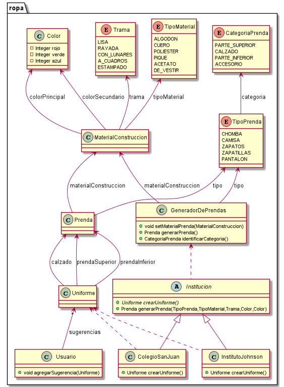

# QMP-Segunda-Iteracion

## Diagrama de clases

<p align="center"> 

</p>

## Explicacion

* 


## Pseudocodigo

~~~

class Material{
    TipoMaterial tipoMaterial;
    Trama trama = Trama.LISA;
}

enum Trama{
    LISA, RAYADA, CON_LUNARES, A_CUADROS, ESTAMPADO
}

//"Como usuarie de QuéMePongo, quiero crear una prenda especificando primero de qué tipo es."
agrego tipoPrenda en el constructor del GeneradorDePrendas

//"Como usuarie de QuéMePongo, quiero crear una prenda especificando en segundo lugar los aspectos relacionados 
//a su material (colores, material, trama, etc) para evitar elegir materiales inconsistentes con el tipo de prenda."
algo asi:
generadorDePendas.describirPrenda(new Color(num, num, num), null, new Material(TipoMaterial.ALGODON, Trama.LISA), etc?);
Para preguntar: :warning:
a que se refiere con etc en el requerimiento? aspectos relacionados a su material? cuales mas?
despues dice "para evitar elegir materiales inconsistentes con el tipo de prenda."
que materiales serian inconsistetes segun su tipo?


//"Como usuarie de QuéMePongo, quiero guardar un borrador de la la última prenda que empecé a cargar para continuar después."
crear una clase BorradorPrenda y usar eso en el Builder. asi si devuelve el Borrador no se puede usar como Prenda 
porque no le dan los tipos. Y si el Borrador ya es valido, generar una Prenda
O MEJOR
guardar el "borrador" adentro del GeneradorDePrendas
asi guarda lo ingresado y solo le dejamos devolver Prendas valida
Asi cumple ultimo requerimiento


class Usuario{
    
    List<Sugerencia> sugerencias;
    
    public void agregarSugerencia(Sugerencia sugerencia){
        sugerencias.add(sugerencia);
    }
}

class Uniforme{
    Prenda prendaSuperior;
    Prenda prendaInferior;
    Prenda calzado;
}

//para ultimo requerimiento
hacer un factory para
colegioSanJuan
institutoJohnson


~~~

---


# Ejecutar tests

```
mvn test
```

# Validar el proyecto de forma exahustiva

```
mvn clean verify
```

Este comando hará lo siguiente:

 1. Ejecutará los tests
 2. Validará las convenciones de formato mediante checkstyle
 3. Detectará la presencia de (ciertos) code smells
 4. Validará la cobertura del proyecto

# Entrega del proyecto

Para entregar el proyecto, crear un tag llamado `entrega-final`. Es importante que antes de realizarlo se corra la validación
explicada en el punto anterior. Se recomienda hacerlo de la siguiente forma:

```
mvn clean verify && git tag entrega-final && git push origin HEAD --tags
```

