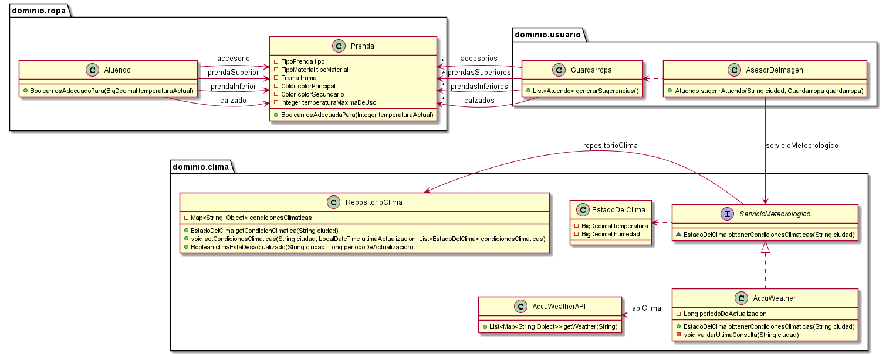

# QMP-Cuarta-Iteracion

## Diagrama de clases - REQUERIMIENTOS DE ESTA ITERACION

<p align="center"> 

</p>

## Notas

* Faltan tests

* El RepositorioClima se usa para guardar las referencias a los datos del clima cacheados, asi 
  cualquier ServicioMeteorologico puede hacceder a esos datos. Se guardan objetos de nustro sistema (EstadoDelTiempo) 
  en vez de guardarlos con la estructura que provee AccuWeatherAPI.
  
  Otras opcion: dejar a AccuWeather con los datos del clima que genera (convirtiendolo en singleton) 
  en ves de usar el RepositorioClima.

* Borre:
~~~
  public void agregarSugerenciaUniforme(Uniforme sugerencia) {
  sugerenciasUniformes.add(sugerencia);
  }
~~~
  Porque ahora las sugerencias ahora son de Atuendos en general. Deberia buscar alguna forma para que los Uniformes 
  sean Atuendos. Capaz haciendo que herede de Atuendo, pero los Uniformes no tienen accesorios. Si no tambien podria 
  hacer que los Atuendos y Uniformes herenden de otra clase y que las sugerencias tengas ese tipo.

## Pseudocodigo

~~~

public interface ServicioMeteorologico {
  EstadoDelClima obtenerCondicionesClimaticas(String ciudad);
}

public class AccuWeather implements ServicioMeteorologico {

  private AccuWeatherAPI apiClima;
  private RepositorioClima repositorioClima;
  private Long periodoDeActualizacion = 12L;

  public AccuWeather(AccuWeatherAPI apiClima, RepositorioClima repositorioClima) {
    this.apiClima = apiClima;
    this.repositorioClima = repositorioClima;
  }

  @Override
  public EstadoDelClima obtenerCondicionesClimaticas(String ciudad) {
    validarUltimaConsulta(ciudad);
    return repositorioClima.getCondicionClimatica(ciudad);
  }

  private void validarUltimaConsulta(String ciudad) {
    if (repositorioClima.climaEstaDesactualizado(ciudad, periodoDeActualizacion)) {
      repositorioClima.setCondicionesClimaticas(
          ciudad,
          LocalDateTime.now(),
          consultarApi(ciudad)
      );
    }
  }

  //devuelve una lista con 12 elementos, uno por cada hora (AccuWeatherAPI devuelve el pronostico de 12 horas)
  private List<EstadoDelClima> consultarApi(String ciudad) {
    return apiClima
        .getWeather(ciudad)
        .stream()
        .map(this::generarEstadoDelClima)
        .collect(Collectors.toList());
  }
}

public class EstadoDelClima {
  BigDecimal temperatura;
  BigDecimal humedad;
}

public class RepositorioClima {

  //SINGLETON <--------------------------------

  private final Map<String, Object> condicionesClimaticas = new HashMap<>();

  public EstadoDelClima getCondicionClimatica(String ciudad) {
    return ((List<EstadoDelClima>) condicionesClimaticas.get(ciudad)).get(horarioAUtilizar(ciudad));
  }

  public void setCondicionesClimaticas(String ciudad, LocalDateTime ultimaActualizacion,
                                       List<EstadoDelClima> condicionesClimaticas) {
    this.condicionesClimaticas.put(ciudad, condicionesClimaticas);
    this.condicionesClimaticas.put(ciudad + "ultimaActualizacion", ultimaActualizacion);
  }

  public Boolean climaEstaDesactualizado(String ciudad, Long periodoDeActualizacion) {
    if (this.ultimaActualizacionDe(ciudad) == null) return true;
    return HOURS.between(LocalDateTime.now(), this.ultimaActualizacionDe(ciudad)) >= periodoDeActualizacion;
  }

  private int horarioAUtilizar(String ciudad) {
    return (int) Duration.between(LocalDateTime.now(), this.ultimaActualizacionDe(ciudad)).toHours();
  }

  private LocalDateTime ultimaActualizacionDe(String ciudad) {
    return (LocalDateTime) condicionesClimaticas.get(ciudad + "ultimaActualizacion");
  }
}

public class AsesorDeImagen {

  private ServicioMeteorologico servicioMeteorologico;

  public AsesorDeImagen(ServicioMeteorologico servicioMeteorologico) {
    this.servicioMeteorologico = servicioMeteorologico;
  }

  public Atuendo sugerirAtuendo(String ciudad, Guardarropa guardarropa) {
    BigDecimal temperaturaActual = servicioMeteorologico.obtenerCondicionesClimaticas(ciudad).getTemperatura();
    return guardarropa.generarSugerencias().stream()
        .filter(atuendo -> atuendo.esAdecuadoPara(temperaturaActual))
        .collect(Collectors.toList())
        .get(0);
  }
}

class Prenda {
  ...
  public Boolean esAdecuadaPara(BigDecimal temperaturaActual) {
    return this.temperaturaMaximaDeUso.compareTo(temperaturaActual) >= 0;
  }
  ...

}

class Atuendo {
  ...
  public Boolean esAdecuadoPara(BigDecimal temperaturaActual) {
    return this.prendaSuperior.esAdecuadaPara(temperaturaActual) &&
        this.prendaInferior.esAdecuadaPara(temperaturaActual) &&
        this.calzado.esAdecuadaPara(temperaturaActual) &&
        this.accesorio.esAdecuadaPara(temperaturaActual);
  }
  ...
}

~~~

---


# Ejecutar tests

```
mvn test
```

# Validar el proyecto de forma exahustiva

```
mvn clean verify
```

Este comando hará lo siguiente:

 1. Ejecutará los tests
 2. Validará las convenciones de formato mediante checkstyle
 3. Detectará la presencia de (ciertos) code smells
 4. Validará la cobertura del proyecto

# Entrega del proyecto

Para entregar el proyecto, crear un tag llamado `entrega-final`. Es importante que antes de realizarlo se corra la validación
explicada en el punto anterior. Se recomienda hacerlo de la siguiente forma:

```
mvn clean verify && git tag entrega-final && git push origin HEAD --tags
```

