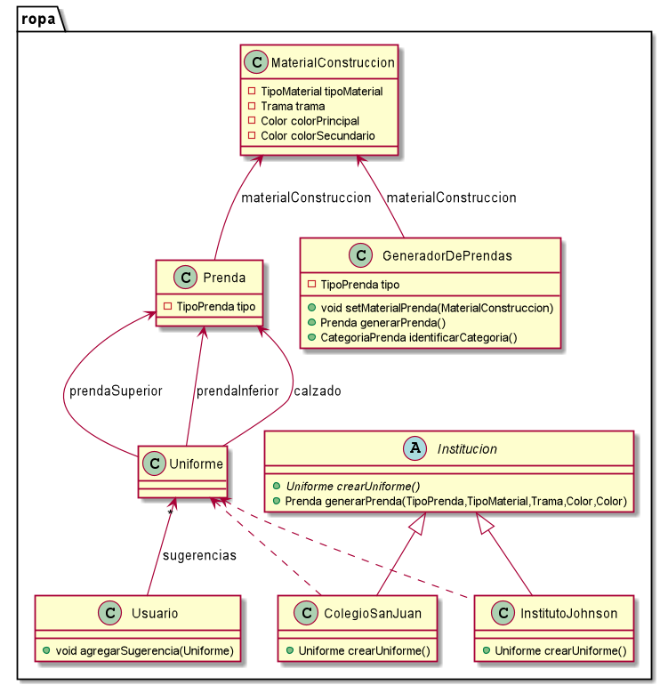

# QMP-Segunda-Iteracion

## Diagrama de clases RESUMIDO

<p align="center"> 

</p>

## Explicacion

*

## Diagrama de clases

<p align="center"> 

</p>


## Pseudocodigo

~~~

class MaterialConstruccion {

  private TipoMaterial tipoMaterial;
  private Trama trama = Trama.LISA;
  private Color colorPrincipal;
  private Color colorSecundario;

  MaterialConstruccion(TipoMaterial tipoMaterial, Trama trama, Color colorPrincipal, Color colorSecundario){
    this.tipoMaterial = tipoMaterial;
    if(trama != null){
      this.trama = trama;
    }
    this.colorPrincipal = colorPrincipal;
    this.colorSecundario = colorSecundario;
  }
}

enum Trama{
    LISA, RAYADA, CON_LUNARES, A_CUADROS, ESTAMPADO
}

class GeneradorDePrendas {

  TipoPrenda tipo;
  MaterialConstruccion materialConstruccion;

  public GeneradorDePrendas(TipoPrenda tipo){
    this.tipo = tipo;
  }

  public void setMaterialPrenda(MaterialConstruccion materialConstruccion){
    this.validarMaterialPrenda(materialConstruccion);
    this.materialConstruccion = materialConstruccion;
  }

  private void validarMaterialPrenda(MaterialConstruccion materialConstruccion) {
    //TODO
    //que materiales serian inconsistetes segun su tipo?
    //"Como usuarie de QuéMePongo, quiero crear una prenda especificando en segundo lugar los aspectos relacionados 
    //a su material (colores, material, trama, etc) para evitar elegir materiales inconsistentes con el tipo de prenda."
    Para preguntar: :warning:
    a que se refiere con etc en el requerimiento? aspectos relacionados a su material? cuales mas?
    despues dice "para evitar elegir materiales inconsistentes con el tipo de prenda."
    que materiales serian inconsistetes segun su tipo?
  }

  public Prenda generarPrenda(){
    this.validarPrenda();
    return new Prenda(this.tipo, this.materialConstruccion);
  }
}


/////////////

class Usuario{
    
    List<Uniforme> sugerencias;
    
    public void agregarSugerencia(Uniforme sugerencia){
        sugerencias.add(sugerencia);
    }
}

class Uniforme{
    Prenda prendaSuperior;
    Prenda prendaInferior;
    Prenda calzado;
}

abstract class Institucion {

  abstract Uniforme crearUniforme()

  Prenda generarPrenda(TipoPrenda tipo, TipoMaterial material, Trama trama, Color colorPrimario, Color colorSecundario){
    GeneradorDePrendas generadorDePrendas = new GeneradorDePrendas(tipo);
    ...
    return generadorDePrendas.generarPrenda();
  }
}

class ColegioSanJuan extends Institucion{

  public Uniforme crearUniforme() {
    Prenda prendaSuperior = this.generarPrenda(...)
    Prenda prendaInferior = this.generarPrenda(...)
    Prenda calzado = this.generarPrenda(...)
    
    return new Uniforme(prendaSuperior, prendaInferior, calzado)
  }
}

class InstitutoJohnson extends Institucion{

  public Uniforme crearUniforme() {
    Prenda prendaSuperior = this.generarPrenda(...)
    Prenda prendaInferior = this.generarPrenda(...)
    Prenda calzado = this.generarPrenda(...)

    return new Uniforme(prendaSuperior, prendaInferior, calzado)
  }
}


~~~

---


# Ejecutar tests

```
mvn test
```

# Validar el proyecto de forma exahustiva

```
mvn clean verify
```

Este comando hará lo siguiente:

 1. Ejecutará los tests
 2. Validará las convenciones de formato mediante checkstyle
 3. Detectará la presencia de (ciertos) code smells
 4. Validará la cobertura del proyecto

# Entrega del proyecto

Para entregar el proyecto, crear un tag llamado `entrega-final`. Es importante que antes de realizarlo se corra la validación
explicada en el punto anterior. Se recomienda hacerlo de la siguiente forma:

```
mvn clean verify && git tag entrega-final && git push origin HEAD --tags
```

