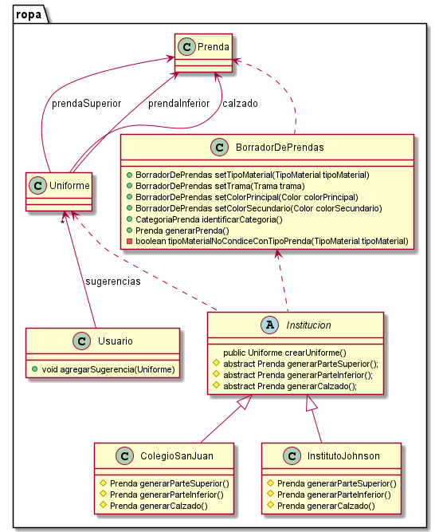
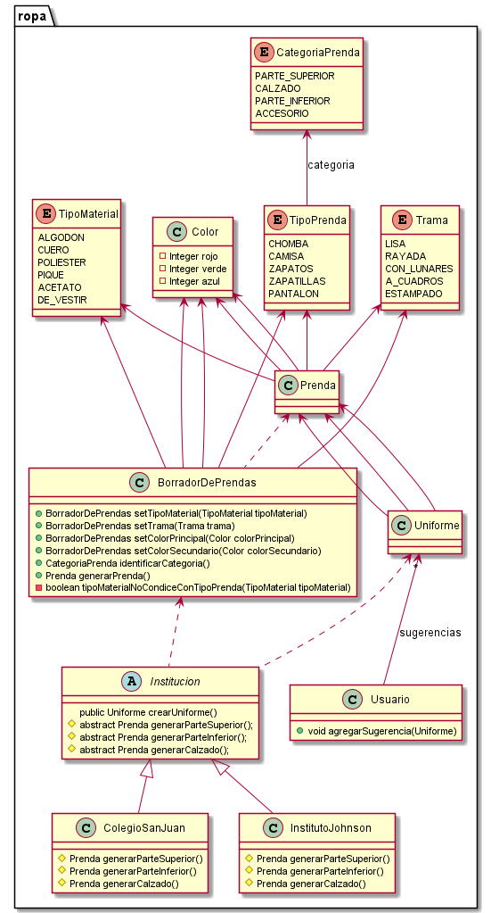

# QMP-Segunda-Iteracion-Refactorizado

## Aclaracion

Para el siguiente requerimiento:

~~~
Como usuarie de QuéMePongo, quiero crear una prenda especificando en segundo lugar 
los aspectos relacionados a su material (colores, material, trama, etc) para evitar 
elegir materiales inconsistentes con el tipo de prenda.
~~~

No estoy dando importancia a como se relacionan TIPOS de prenda con los MATERIALES para saber cuando se condicen y cuando no, 
ya que parece que no es relevante para este ejercicio. De todas formas, la clase "GeneradorDePrendas" es la que se 
encarga de validar esto cuando se ingresa el material de la prenda, delegando esta funcionalidad a uno de sus metodos.


## Diagrama de clases - REQUERIMIENTOS DE ESTA ITERACION

<p align="center"> 

</p>

## Explicacion

* La clase "BorradorDePrendas" estaría representando un builder para configurar "Prenda". Esto permite utilizar una 
  instancia de "BorradorDePrendas" como un borrador para despues continuar configurando una prenda. 
  Antes de generar una "Prenda", el "GeneradorDePrendas" se encarga de validar lo ingresado.


* Se agregó la abstraccion "Uniforme" con 3 atributos tipo "Prenda".


* Se agregó la abstraccion "Usuario" con una lista "Sugerencias" de tipo "Uniforme" y un metodo para agregar Uniformes
  para tratarlos como sugerencias recibidas.


* El metodo "crearUniforme()" de la clase "Institucion" estaría representando un factory method. 
  Los hook method se implementan en las subclases "ColegioSanJuan" e "InstitutoJohnson". Esto permite agregar 
  nuevas Instituciones para configurar diferentes Uniformes a futuro. Esto permite que el sistema sea más extensible. 
  Además de que permite no repetir logica al tener los metodos comunes en la superclase abstracta.
  

## Diagrama de clases - SOLUCION COMPLETA

<p align="center"> 

</p>


## Pseudocodigo

~~~

class Usuario {

  private GeneradorSugerencias generador;
  
  public Clima obtenerClimaActual(buenosAires) {}
  
  public void agregarSugerencia(Atuendo sugerencia){
    sugerencias.add(sugerencia);
  }
  
  public void pedirSugerencia(String ciudad) {
    agregarSugerencia(generador.generarSugerencia(String ciudad));
  }

}

class Atuendo {

  private List<Prenda> prendaSuperiores;
  private List<Prenda> prendaInferiores;
  private List<Prenda> calzados;
  private List<Prenda> accesorios;
}

class GeneradorSugerencias {

  private ServicioClima servicioClima = new ServicioClima();

  public Atuendo generarSugerencia(String ciudad) {
  
    servicioClima.obtenerClimaActual(String ciudad);
    ...
    
  }
  
}

class ServicioClima implements AccuWeatherAPI { //????

  private List<Map<String, Object>> condicionesClimaticas; //cache para ahorrar costes. TODO => revisar esto
  
  public Clima obtenerClimaActual(String ciudad) {
    AccuWeatherAPI apiClima = new AccuWeatherAPI();
    List<Map<String, Object>> condicionesClimaticas = apiClima.getWeather(ciudad);  
    condicionesClimaticas.get(0).get("PrecipitationProbability"); //Devuelve un número del 0 al 1
    ...
  }
  
}


//Como stakeholder de QuéMePongo, quiero poder asegurar la calidad de mi aplicación sin incurrir en costos innecesarios. 
// ==>> usar moks para testear


~~~

~~~

public class Prenda {

  private TipoPrenda tipo;
  private TipoMaterial tipoMaterial;
  private Trama trama;
  private Color colorPrincipal;
  private Color colorSecundario;

  public Prenda(TipoPrenda tipo, TipoMaterial tipoMaterial, Trama trama, Color colorPrincipal, Color colorSecundario){
    this.tipo = tipo;
    this.tipoMaterial = tipoMaterial;
    this.trama = trama;
    this.colorPrincipal = colorPrincipal;
    this.colorSecundario = colorSecundario;
  }
}

enum Trama{
    LISA, RAYADA, CON_LUNARES, A_CUADROS, ESTAMPADO
}

class BorradorDePrendas {

  TipoPrenda tipo;
  TipoMaterial tipoMaterial;
  Trama trama = Trama.LISA; //valor por defecto
  Color colorPrincipal;
  Color colorSecundario;

  BorradorDePrendas(TipoPrenda tipo){
    if(tipo == null)
      throw new PrendaInvalidaException("Falta ingresar TIPO a la prenda");
    this.tipo = tipo;
  }

  BorradorDePrendas setTipoMaterial(TipoMaterial tipoMaterial){
    if(tipoMaterialNoCondiceConTipoPrenda(tipoMaterial)){
      throw new PrendaInvalidaException(
          "El TIPO DE MATERIAL DE CONSTRUCCION ingresado no condice con el TIPO DE PRENDA ingresado anteriormente");
    }
    this.tipoMaterial = tipoMaterial;
    return this;
  }

  BorradorDePrendas setTrama(Trama trama){
    if(trama != null){
      this.trama = trama;
    }
    return this;
  }

  BorradorDePrendas setColorPrincipal(Color colorPrincipal){
    if(colorPrincipal == null)
      throw new PrendaInvalidaException("Falta ingresar COLOR PRINCIPAL a la prenda");
    this.colorPrincipal = colorPrincipal;
    return this;
  }

  BorradorDePrendas setColorSecundario(Color colorSecundario){
    this.colorSecundario = colorSecundario;
    return this;
  }

  CategoriaPrenda identificarCategoria() {
    return tipo.getCategoria();
  }

  Prenda generarPrenda(){
    if(tipoMaterial == null)
      throw new PrendaInvalidaException("Falta ingresar TIPO DE MATERIAL DE CONSTRUCCION a la prenda");
    if(colorPrincipal == null)
      throw new PrendaInvalidaException("Falta ingresar COLOR PRINCIPAL a la prenda");

    return new Prenda(tipo, tipoMaterial, trama, colorPrincipal, colorSecundario);
  }
}


/////////////

class Usuario{
    
    List<Uniforme> sugerencias
    
    public void agregarSugerencia(Uniforme sugerencia){
        sugerencias.add(sugerencia)
    }
}

class Uniforme{
    Prenda prendaSuperior
    Prenda prendaInferior
    Prenda calzado
}

abstract class Institucion {

  public Uniforme crearUniforme() {
    return new Uniforme(this.generarParteSuperior(), this.generarParteInferior(), this.generarCalzado());
  }

  protected abstract Prenda generarParteSuperior();
  protected abstract Prenda generarParteInferior();
  protected abstract Prenda generarCalzado();
}

class ColegioSanJuan extends Institucion{

  protected abstract Prenda generarParteSuperior(){
    ...
  }
  
  protected abstract Prenda generarParteInferior(){
    ...
  }
  
  protected abstract Prenda generarCalzado(){
    ...
  }
}

class InstitutoJohnson extends Institucion{

  protected abstract Prenda generarParteSuperior(){
    ...
  }
  
  protected abstract Prenda generarParteInferior(){
    ...
  }
  
  protected abstract Prenda generarCalzado(){
    ...
  }
}


~~~

---


# Ejecutar tests

```
mvn test
```

# Validar el proyecto de forma exahustiva

```
mvn clean verify
```

Este comando hará lo siguiente:

 1. Ejecutará los tests
 2. Validará las convenciones de formato mediante checkstyle
 3. Detectará la presencia de (ciertos) code smells
 4. Validará la cobertura del proyecto

# Entrega del proyecto

Para entregar el proyecto, crear un tag llamado `entrega-final`. Es importante que antes de realizarlo se corra la validación
explicada en el punto anterior. Se recomienda hacerlo de la siguiente forma:

```
mvn clean verify && git tag entrega-final && git push origin HEAD --tags
```

