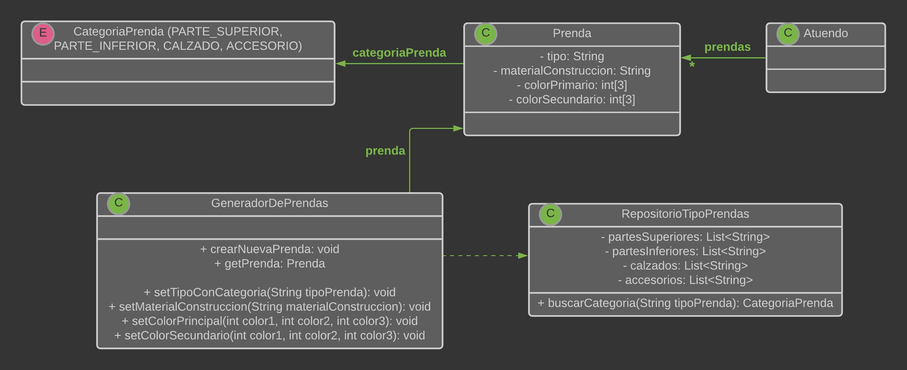
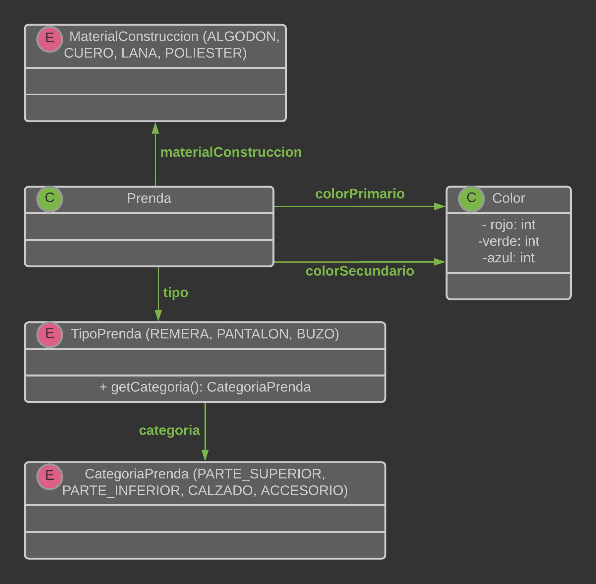

# QMP1-Primera-Iteracion

## Diagrama de clases ORIGINAL

<p align="center"> 

</p>

## Explicacion

* La clase "Prenda" tiene estado, pero no tiene comportamiento relevante (por el momento). No se debe poder
  instanciar clases de "Prenda" directamente, se deben instanciar desde el "GeneradorDePrendas"


* La clase "GeneradorDePrendas" sirve para configurar las instancias de "Prenda" y dejarlas con un estado aceptable
  para el sistema. Además esta clase permite evitar tener un constructor de "Prenda" con demasiados atributos.


* La clase "RepositorioTipoVentas" es un singleton que usamos para tratar de representar lo que sería una petición a
  una base de datos, aunque no sabemos si sería correcto. La idea es que las listas que están en esta clase se puedan
  persistir y actualizar para poder identificar TIPOS de prendas válidos. Que a su vez nos permite identificar a que
  categoria pertenece una prenda.
  

## Diagrama de clases REFACTORIZADO

<p align="center"> 

</p>

## Explicacion

* El enum "TipoPrenda" representa los tipos de prendas. Deberia analizar el conjunto de tipos de prendas 
  (si son muchos o pocos, estáticos o dinámicos, cada cuánto se van a actualizar, etc.) para determinar si 
  usar un String, una clase o un enum. Segun lo visto en clase, son estáticos y son pocos tipos de prendas, 
  entonces convendría utilizar un enum. Lo mismo pasa con el enum "MaterialConstruccion".
  

* Por defecto, cada tipo de prenda conoce a que categoria pertenece cuando se inicializa. De esta manera, la categoria 
  siempre condice con el tipo de la prenda


## Pseudocodigo-REFACTORIZADO

~~~

class Prenda{
  TipoPrenda tipo;
  MaterialConstruccion materialConstruccion;
  Color colorPrincipal;
  Color colorSecundario;
  
  Prenda(TipoPrenda tipo, MaterialConstruccion materialConstruccion, Color colorPrincipal, Color colorSecundario){
    validarPrenda(tipo, materialConstruccion, colorPrincipal);
    this.tipo = tipo;
    this.materialConstruccion = materialConstruccion;
    this.colorPrincipal = colorPrincipal;
    this.colorSecundario = colorSecundario;
  }
  
  private validarPrenda(TipoPrenda tipo, MaterialConstruccion materialConstruccion, Color colorPrincipal){
    if(tipo == null || materialConstruccion == null || colorPrincipal == null){
        throw new PrendaInvalidaException("Falta ingresar TIPO, MATERIAL DE CONSTRUCCION o COLOR PRINCIPAL de la prenda");
    }
  }
  
}

enum TipoPrenda{
    REMERA(CategoriaPrenda.PARTE_SUPERIOR), BUZO(CategoriaPrenda.PARTE_SUPERIOR), CAMPERA(CategoriaPrenda.PARTE_SUPERIOR), 
    ZAPATILLAS(CategoriaPrenda.CALZADO), ZAPATOS(CategoriaPrenda.CALZADO), BOTAS(CategoriaPrenda.CALZADO),
     MEDIAS(CategoriaPrenda.PARTE_INFERIOR), BERMUDA(CategoriaPrenda.PARTE_INFERIOR), PANTALON(CategoriaPrenda.PARTE_INFERIOR), 
     LENTES(CategoriaPrenda.ACCESORIO)
    
    private CategoriaPrenda categoria;
    
    private TipoPrenda(CategoriaPrenda categoria){
        this.categoria = categoria;
    }
    
    public CategoriaPrenda getCategoria(){
        return this.categoria;
    }
}

enum CategoriaPrenda(){
    PARTE_SUPERIOR, PARTE_INFERIOR, CALZADO, ACCESORIO
}

enum MaterialConstruccion{
    ALGODON, JEAN, CUERO, POLIESTER, LANA
}

class Color{
    int rojo;
    int verde;
    int azul;
}

~~~

## Pseudocodigo ORIGINAL

~~~

class Atuendo{
  List<Prenda> prendas
  
}

class Prenda{
  String tipo
  CategoriaPrenda categoria
  String materialConstruccion
  int[] colorPrincipal = new int[3];
  int[] colorSecundario = new int[3];
  
  
  setTipo(String tipo){
    TODO ❕
  }
  
  setCategoria(CategoriaPrenda categoria){
    TODO ❕
  }
  
  setMaterialConstruccion(String materialConstruccion){
    TODO ❕
  }
  
  setColorPrincipal(int color1, int color2, int color3){
    TODO ❕
  }
  
  setColorSecundario(int color1, int color2, int color3){
    TODO ❕
  }
}


enum CategoriaPrenda{
  PARTE-SUPERIOR, CALZADO, PARTE-INFERIOR, ACCESORIO
}

class GeneradorDePrendas{
  Prenda prenda
  
  
  crearNuevaPrenda(){
    prenda = new Prenda();
  }
  
  getPrenda(){
  
    if(!prenda.tipo || !prenda.materialConstruccion || !prenda.colorPrimario){
      throw new exception("La prenda generada no es valida. Debe tener tipo de prenda, material de construccion y color primario")
    }
    
    return prenda;
  }
  
  
  
  
  setTipoConCategoria(String tipoPrenda){
    prenda.setTipo(tipoPrenda)
    CategoriaPrenda categoria = RepositorioTipoPrendas.instance().buscarCategoria(tipo)
    
    prenda.setCategoria(categoria)
  }
  
  setMaterialConstruccion(String materialConstruccion){
    prenda.setMaterialConstruccion(materialConstruccion)
  }
  
  setColorPrincipal(int color1, int color2, int color3){
    prenda.setColorPrincipal(color1, color2, color3)
  }
  
  setColorSecundario(int color1, int color2, int color3){
    prenda.setColorSecundario(color1, color2, color3)
  }
  

}


class RepositorioTipoPrendas{

  private static final RepositorioTipoPrendas INSTANCE = new RepositorioTipoPrendas();
  
  private RepositorioTipoPrendas(){}  //constructor
  
  public static RepositorioTipoPrendas instance(){
    return INSTANCE
  }
  
  List<String> partesSuperiores
  List<String> partesInferiores
  List<String> calzados
  List<String> accesorios
  
  
  buscarCategoria(String tipoPrenda){
    
    if(partesSuperiores.contains(tipoPrenda)) return CategoriaPrenda.PARTE-SUPERIOR
    if(partesInferiores.contains(tipoPrenda)) return CategoriaPrenda.PARTE-INFERIOR
    if(calzados.contains(tipoPrenda)) return CategoriaPrenda.CALZADO
    if(accesorios.contains(tipoPrenda)) return CategoriaPrenda.ACCESORIO
    else{
    	throw new exception("El tipo de prenda ingresado no es valido")
    }
  }
   
}


~~~


---


# Ejecutar tests

```
mvn test
```

# Validar el proyecto de forma exahustiva

```
mvn clean verify
```

Este comando hará lo siguiente:

 1. Ejecutará los tests
 2. Validará las convenciones de formato mediante checkstyle
 3. Detectará la presencia de (ciertos) code smells
 4. Validará la cobertura del proyecto

# Entrega del proyecto

Para entregar el proyecto, crear un tag llamado `entrega-final`. Es importante que antes de realizarlo se corra la validación
explicada en el punto anterior. Se recomienda hacerlo de la siguiente forma:

```
mvn clean verify && git tag entrega-final && git push origin HEAD --tags
```

