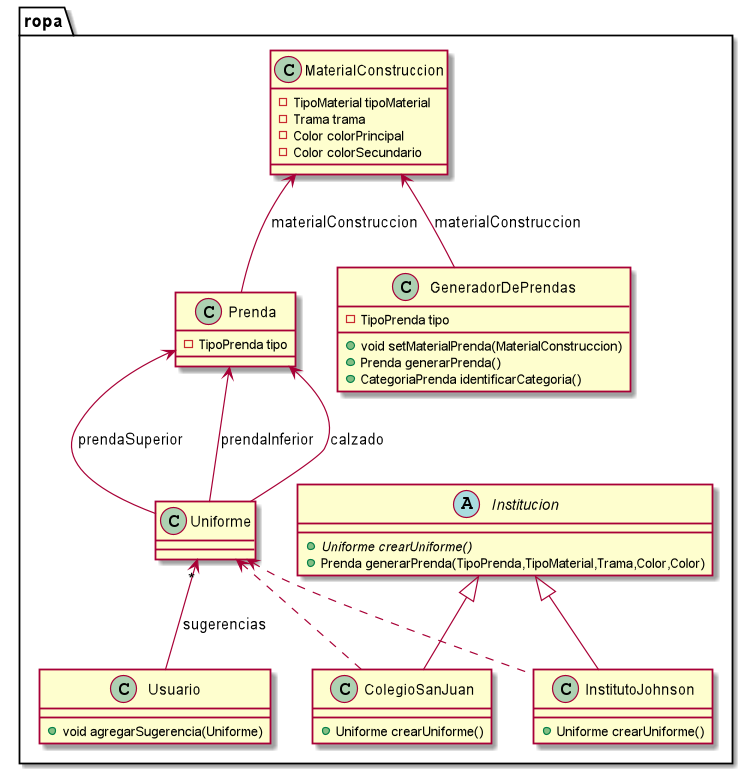
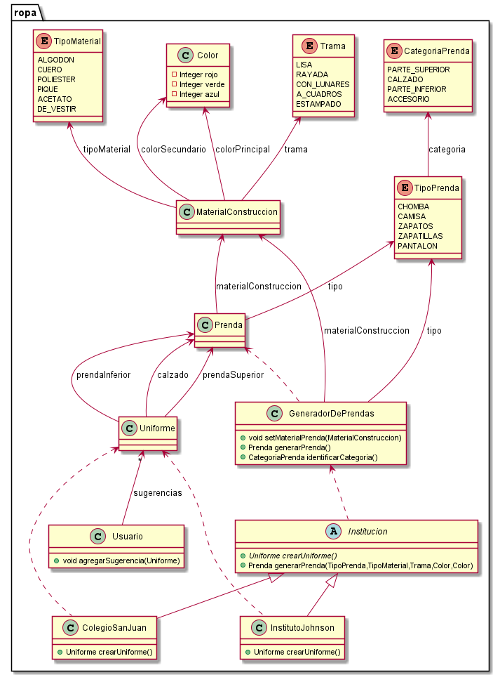

# QMP-Segunda-Iteracion

## Aclaracion

Para el siguiente requerimiento:

~~~
Como usuarie de QuéMePongo, quiero crear una prenda especificando en segundo lugar 
los aspectos relacionados a su material (colores, material, trama, etc) para evitar 
elegir materiales inconsistentes con el tipo de prenda.
~~~

No estoy dando importancia a como se relacionan TIPOS de prenda con los MATERIALES para saber cuando se condicen y cuando no, 
ya que parece que no es relevante para este ejercicio. De todas formas, la clase "GeneradorDePrendas" es la que se 
encarga de validar esto cuando se ingresa el material de la prenda, delegando esta funcionalidad a uno de sus metodos.


## Diagrama de clases - REQUERIMIENTOS DE ESTA ITERACION

<p align="center"> 

</p>

## Explicacion

* Se agregó la abstraccion "MaterialConstruccion" separándola de la "Prenda" y se dejó una referencia a ella desde "Prenda". 
  Esto permite tener 2 abstracciones más cohesivas a costa de tenerlas un poco acopladas.
  

* La clase "GeneradorDePrendas" estaría representando un builder para configurar "Prenda". Esto permite utilizar una 
  instancia de "GeneradorDePrendas" como un borrador para despues continuar configurando una prenda. 
  Antes de generar una "Prenda", el "GeneradorDePrendas" se encarga de validar lo ingresado.


* Se agregó la abstraccion "Uniforme" con 3 atributos tipo "Prenda".


* Se agregó la abstraccion "Usuario" con una lista "Sugerencias" de tipo "Uniforme" y un metodo para agregar Uniformes
  para tratarlos como sugerencias recibidas.


* El metodo "crearUniforme()" de la clase "Institucion" estaría representando un factory method. 
  El cual se implementa en las subclases "ColegioSanJuan" e "InstitutoJohnson". Esto permite agregar 
  nuevas Instituciones para configurar diferentes Uniformes a futuro. Esto permite que el sistema sea más extensible. 
  Además de que, al menos en este caso, permite no repetir logica al tener los metodos comunes en la superclase abstracta.
  El metodo en comun es "generarPrenda(...)".
  

## Diagrama de clases - SOLUCION COMPLETA

<p align="center"> 

</p>


## Pseudocodigo

~~~

class MaterialConstruccion {

  private TipoMaterial tipoMaterial
  private Trama trama = Trama.LISA
  private Color colorPrincipal
  private Color colorSecundario

  MaterialConstruccion(TipoMaterial tipoMaterial, Trama trama, Color colorPrincipal, Color colorSecundario){
    this.tipoMaterial = tipoMaterial
    if(trama != null){
      this.trama = trama
    }
    this.colorPrincipal = colorPrincipal
    this.colorSecundario = colorSecundario
  }
}

enum Trama{
    LISA, RAYADA, CON_LUNARES, A_CUADROS, ESTAMPADO
}

class GeneradorDePrendas {

  TipoPrenda tipo
  MaterialConstruccion materialConstruccion

  public GeneradorDePrendas(TipoPrenda tipo){
    if(tipo == null){
      throw new PrendaInvalidaException("Falta ingresar TIPO de la prenda")
    }
    this.tipo = tipo
  }
  
  public void setMaterialPrenda(MaterialConstruccion materialConstruccion){
    this.validarMaterialPrenda(materialConstruccion)
    this.materialConstruccion = materialConstruccion
  }
  
  public Prenda generarPrenda(){
    return new Prenda(this.tipo, this.materialConstruccion)
  }

  private void validarMaterialPrenda(MaterialConstruccion materialConstruccion) {
    if(materialConstruccion.getTipoMaterial() == null){
      throw new PrendaInvalidaException("Falta ingresar el TIPO DE MATERIAL DE CONSTRUCCION de la prenda")
    }
    if(materialConstruccion.getColorPrincipal() == null){
      throw new PrendaInvalidaException("Falta ingresar COLOR PRINCIPAL de la prenda")
    }
    if(materialConstruccionNoCondiceConElTipo(materialConstruccion.getTipoMaterial())){
      throw new PrendaInvalidaException(
          "El TIPO DE MATERIAL DE CONSTRUCCION ingresado no condice con el TIPO DE PRENDA ingresado anteriormente")
    }
  }
}


/////////////

class Usuario{
    
    List<Uniforme> sugerencias
    
    public void agregarSugerencia(Uniforme sugerencia){
        sugerencias.add(sugerencia)
    }
}

class Uniforme{
    Prenda prendaSuperior
    Prenda prendaInferior
    Prenda calzado
}

abstract class Institucion {

  abstract Uniforme crearUniforme()

  Prenda generarPrenda(TipoPrenda tipo, TipoMaterial material, Trama trama, Color colorPrimario, Color colorSecundario){
    GeneradorDePrendas generadorDePrendas = new GeneradorDePrendas(tipo)
    ...
    return generadorDePrendas.generarPrenda()
  }
}

class ColegioSanJuan extends Institucion{

  public Uniforme crearUniforme() {
    Prenda prendaSuperior = this.generarPrenda(...)
    Prenda prendaInferior = this.generarPrenda(...)
    Prenda calzado = this.generarPrenda(...)
    
    return new Uniforme(prendaSuperior, prendaInferior, calzado)
  }
}

class InstitutoJohnson extends Institucion{

  public Uniforme crearUniforme() {
    Prenda prendaSuperior = this.generarPrenda(...)
    Prenda prendaInferior = this.generarPrenda(...)
    Prenda calzado = this.generarPrenda(...)

    return new Uniforme(prendaSuperior, prendaInferior, calzado)
  }
}


~~~

---


# Ejecutar tests

```
mvn test
```

# Validar el proyecto de forma exahustiva

```
mvn clean verify
```

Este comando hará lo siguiente:

 1. Ejecutará los tests
 2. Validará las convenciones de formato mediante checkstyle
 3. Detectará la presencia de (ciertos) code smells
 4. Validará la cobertura del proyecto

# Entrega del proyecto

Para entregar el proyecto, crear un tag llamado `entrega-final`. Es importante que antes de realizarlo se corra la validación
explicada en el punto anterior. Se recomienda hacerlo de la siguiente forma:

```
mvn clean verify && git tag entrega-final && git push origin HEAD --tags
```

