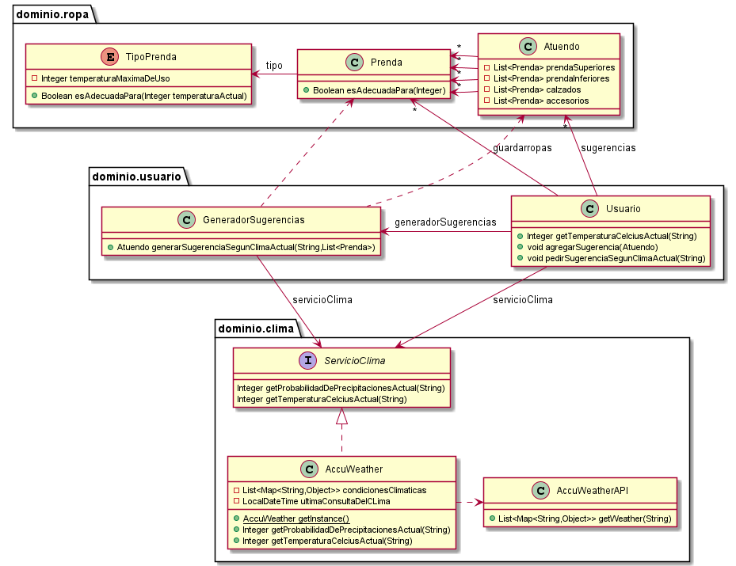

# QMP-Cuarta-Iteracion

## Diagrama de clases - REQUERIMIENTOS DE ESTA ITERACION

<p align="center"> 

</p>

## Explicacion

* 


* La clase "BorradorDePrendas" estaría representando un builder para configurar "Prenda". Esto permite utilizar una 
  instancia de "BorradorDePrendas" como un borrador para despues continuar configurando una prenda. 
  Antes de generar una "Prenda", el "GeneradorDePrendas" se encarga de validar lo ingresado.


* Se agregó la abstraccion "Uniforme" con 3 atributos tipo "Prenda".


* Se agregó la abstraccion "Usuario" con una lista "Sugerencias" de tipo "Uniforme" y un metodo para agregar Uniformes
  para tratarlos como sugerencias recibidas.


* El metodo "crearUniforme()" de la clase "Institucion" estaría representando un factory method. 
  Los hook method se implementan en las subclases "ColegioSanJuan" e "InstitutoJohnson". Esto permite agregar 
  nuevas Instituciones para configurar diferentes Uniformes a futuro. Esto permite que el sistema sea más extensible. 
  Además de que permite no repetir logica al tener los metodos comunes en la superclase abstracta.
  

## Diagrama de clases - SOLUCION COMPLETA

<p align="center"> 

</p>


## Pseudocodigo

~~~

class Usuario {

  private List<Atuendo> sugerencias = new ArrayList();
  private GeneradorSugerencias generador;
  private ServicioClima servicioClima;
  private List<Prenda> guardarropas;

  public Usuario(GeneradorSugerencias generador, ServicioClima servicioClima) {
    this.generador = generador;
    this.servicioClima = servicioClima;
  }
  
  public Integer getTemperaturaCelciusActual(String ciudad) {
    return servicioClima.getTemperaturaCelciusActual(ciudad);
  }
  
  public void agregarSugerencia(Atuendo sugerencia){
    sugerencias.add(sugerencia);
  }
  
  public void pedirSugerenciaSegunClimaActual(String ciudad) {
    agregarSugerencia(generador.generarSugerenciaSegunClimaActual(ciudad, guardarropas));
  }

}

class Atuendo {

  private List<Prenda> prendaSuperiores;
  private List<Prenda> prendaInferiores;
  private List<Prenda> calzados;
  private List<Prenda> accesorios;
}

class GeneradorSugerencias {

  private ServicioClima servicioClima;
  
  public GeneradorSugerencias(ServicioClima servicioClima) {
    this.servicioClima = servicioClima;
  }

  public Atuendo generarSugerenciaSegunClimaActual(String ciudad, List<Prenda> prendas) {
  
    Integer temperaturaActual = servicioClima.getTemperaturaCelciusActual(ciudad);
    prendasAdecuadas = prendas.filter(prenda -> prenda.esAdecuadaPara(temperaturaActual));
    return generarAtuendo(prendasAdecuadas);
  }
  
  private Atuendo generarAtuendo(List<Prenda> prendas) {
    return new Atuendo(); //TODO
  }
  
}

public enum TipoPrenda {

  CHOMBA(CategoriaPrenda.PARTE_SUPERIOR, 50), CAMISA(CategoriaPrenda.PARTE_SUPERIOR, 50)
  
  private CategoriaPrenda categoria;
  private Integer temperaturaMaximaDeUso;

  TipoPrenda(CategoriaPrenda categoria, Integer temperaturaMaximaDeUso){
    this.categoria = categoria;
    this.temperaturaMaximaDeUso = temperaturaMaximaDeUso;
  }

  public CategoriaPrenda getCategoria(){
    return this.categoria;
  }
  
  public Integer getTemperaturaMaximaDeUso(){
    return this.temperaturaMaximaDeUso;
  }
  
  public Boolean esAdecuadaPara(Integer temperaturaActual){
    return this.temperaturaMaximaDeUso >= temperaturaActual;
  }
}

interface ServicioClima {
  
  Integer getProbabilidadDePrecipitacionesActual(String ciudad);
  
  Integer getTemperaturaCelciusActual(String ciudad);
}

class AccuWeather implements ServicioClima {

  private List<Map<String, Object>> condicionesClimaticas; //cacheado para ahorrar costes
  LocalDateTime ultimaConsultaDelCLima = LocalDateTime.now() - 13 horas;
  
  
  private static AccuWeather INSTANCE;

  //usariamos el constructor solo para tests
  public AccuWeather() { }

  //usariamos el getInstance en el codigo
  public static AccuWeather getInstance() {
    if (INSTANCE == null) {
      INSTANCE = new AccuWeather();
    }
    return INSTANCE;
  }

  
  public Integer getProbabilidadDePrecipitacionesActual(String ciudad) {
    validarUltimaConsulta(ciudad) //logica repetida, no creo que valga la pena arreglarlo
    return condicionesClimaticas.get(0).get("PrecipitationProbability"); //Devuelve un número del 0 al 1
  }
  
  public Integer getTemperaturaCelciusActual(String ciudad) {
    validarUltimaConsulta(ciudad) //logica repetida, no creo que valga la pena arreglarlo
    return pasarACelcius(condicionesClimaticas.get(0).get("Temperature").get("Value"));
  }
  
  private void validarUltimaConsulta(String ciudad) {
    if (seConsultoClimaHaceMasDe(12 horas)) {
      AccuWeatherAPI apiClima = new AccuWeatherAPI();
      condicionesClimaticas = apiClima.getWeather(ciudad);
      ultimaConsultaDelCLima = LocalDateTime.now(); 
    }
  }
  
  private Boolean seConsultoClimaHaceMasDe(periodo) {
    return (LocalDateTime.now() - ultimaConsultaDelCLima) >= periodo //TODO
  }
  
  private Integer pasarACelcius(Integer fahrenheit) {
    return 33;  //TODO
  }
  
}


~~~

---


# Ejecutar tests

```
mvn test
```

# Validar el proyecto de forma exahustiva

```
mvn clean verify
```

Este comando hará lo siguiente:

 1. Ejecutará los tests
 2. Validará las convenciones de formato mediante checkstyle
 3. Detectará la presencia de (ciertos) code smells
 4. Validará la cobertura del proyecto

# Entrega del proyecto

Para entregar el proyecto, crear un tag llamado `entrega-final`. Es importante que antes de realizarlo se corra la validación
explicada en el punto anterior. Se recomienda hacerlo de la siguiente forma:

```
mvn clean verify && git tag entrega-final && git push origin HEAD --tags
```

