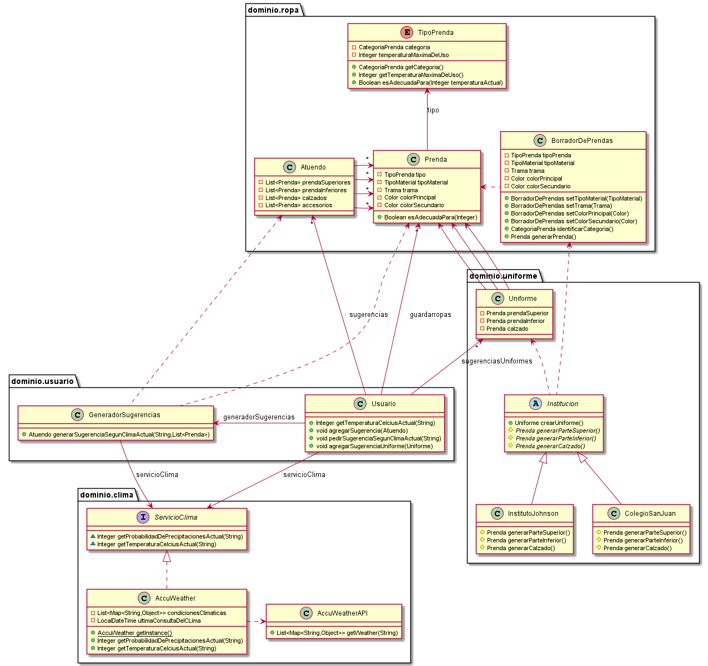

# QMP-Quinta-Iteracion

## Diagrama de clases - REQUERIMIENTOS DE ESTA ITERACION

<p align="center"> 

</p>

## Explicacion

* Para que el Usuario pueda conocer las condiciones climaticas, se le agregó un metodo para consultar 
  contra el ServicioClima directamente. Se podría consultar contra el GeneradorSugerencias, pero solo serviría para 
  volver a delegar el mensaje en el ServicioClima. Además de que semánticamente no tendria mucho sentido.


* Para que se puedan recibir las sugerencias, se agregó la clase Atuendos con 4 listas, una para cada categoria de 
  prenda, lo cual permite que se le puedan agregar más prendas a futuro sin problemas, lo cual hace que la solucion 
  sea un poco más extensible.
  

* Para que cada prenda tenga especificada su temperatura maxima soportable, se agregó el atributo 
  "temperaturaMaximaDeUso" a cada TipoPrenda, lo cual permite tratarlas de manera polimórfica.
  

* Para poder configurar fácilmente diferentes servicios de obtención del clima se generó una interfaz "ServicioClima", 
  para que las clases que lo implementen se encarguen de tener la logica necesaria para obtener el clima de un 
  determinado proveedor. Esto permite agregar otra implementacion (en otra clase que implemente "ServicioClima") para 
  otro proveedor manteniendo la misma interfaz. De esta forma, la implementacion especifica para obtener el clima 
  no estaría acoplada al resto de nuestro sistema, lo que favorece la extensibilidad. Y además que nuestro sistema 
  siempre va a consultar contra la misma interfaz, sin importar de que proveedor de clima se tratase.
  

* Para evitar costos adicionales, se decidio cachear los datos provistos por el ServicioClima para realizar la minima 
  cantidad de consultas necesarias.
  


## Diagrama de clases - SOLUCION COMPLETA

<p align="center"> 

</p>


## Pseudocodigo

~~~

class Usuario {

  private final List<Prenda> guardarropas;
  private final List<Atuendo> sugerencias;
  private final GeneradorSugerencias generadorSugerencias;
  private final ServicioClima servicioClima;

  public Usuario(List<Prenda> guardarropas, List<Atuendo> sugerencias, GeneradorSugerencias generadorSugerencias, 
                ServicioClima servicioClima) {
    this.guardarropas = guardarropas;
    this.sugerencias = sugerencias;
    this.generadorSugerencias = generadorSugerencias;
    this.servicioClima = servicioClima;
  }
  
  public Integer getTemperaturaCelciusActual(String ciudad) {
    return servicioClima.getTemperaturaCelciusActual(ciudad);
  }
  
  public void agregarSugerencia(Atuendo sugerencia){
    sugerencias.add(sugerencia);
  }
  
  public void pedirSugerenciaSegunClimaActual(String ciudad) {
    agregarSugerencia(generador.generarSugerenciaSegunClimaActual(ciudad, guardarropas));
  }

}

class Atuendo {

  private List<Prenda> prendaSuperiores;
  private List<Prenda> prendaInferiores;
  private List<Prenda> calzados;
  private List<Prenda> accesorios;
}

class GeneradorSugerencias {

  private ServicioClima servicioClima;
  
  public GeneradorSugerencias(ServicioClima servicioClima) {
    this.servicioClima = servicioClima;
  }

  public Atuendo generarSugerenciaSegunClimaActual(String ciudad, List<Prenda> prendas) {
    Integer temperaturaActual = servicioClima.getTemperaturaCelciusActual(ciudad);
    prendasAdecuadas = prendas.filter(prenda -> prenda.esAdecuadaPara(temperaturaActual));
    return generarAtuendo(prendasAdecuadas);
  }
  
  private Atuendo generarAtuendo(List<Prenda> prendas) {
    return new Atuendo(); //TODO
  }
  
}

public enum TipoPrenda {

  CHOMBA(CategoriaPrenda.PARTE_SUPERIOR, 50), CAMISA(CategoriaPrenda.PARTE_SUPERIOR, 50)
  
  private CategoriaPrenda categoria;
  private Integer temperaturaMaximaDeUso;

  TipoPrenda(CategoriaPrenda categoria, Integer temperaturaMaximaDeUso){
    this.categoria = categoria;
    this.temperaturaMaximaDeUso = temperaturaMaximaDeUso;
  }

  public CategoriaPrenda getCategoria(){
    return this.categoria;
  }
  
  public Integer getTemperaturaMaximaDeUso(){
    return this.temperaturaMaximaDeUso;
  }
  
  public Boolean esAdecuadaPara(Integer temperaturaActual){
    return this.temperaturaMaximaDeUso >= temperaturaActual;
  }
}

interface ServicioClima {
  
  Integer getProbabilidadDePrecipitacionesActual(String ciudad);
  
  Integer getTemperaturaCelciusActual(String ciudad);
}

class AccuWeather implements ServicioClima {

  private List<Map<String, Object>> condicionesClimaticas; //cacheado para ahorrar costes
  private LocalDateTime ultimaConsultaDelCLima = LocalDateTime.now() - 13 horas;
  
  
  private static AccuWeather INSTANCE;

  //usariamos el constructor solo para tests
  public AccuWeather() { }

  //usariamos el getInstance en el codigo
  public static AccuWeather getInstance() {
    if (INSTANCE == null) {
      INSTANCE = new AccuWeather();
    }
    return INSTANCE;
  }

  
  public Integer getProbabilidadDePrecipitacionesActual(String ciudad) {
    validarUltimaConsulta(ciudad) //logica repetida, no creo que valga la pena arreglarlo
    return condicionesClimaticas.get(0).get("PrecipitationProbability"); //Devuelve un número del 0 al 1
  }
  
  public Integer getTemperaturaCelciusActual(String ciudad) {
    validarUltimaConsulta(ciudad) //logica repetida, no creo que valga la pena arreglarlo
    return pasarACelcius(condicionesClimaticas.get(0).get("Temperature").get("Value"));
  }
  
  private void validarUltimaConsulta(String ciudad) {
    if (seConsultoClimaHaceMasDe(12 horas)) {
      AccuWeatherAPI apiClima = new AccuWeatherAPI();
      condicionesClimaticas = apiClima.getWeather(ciudad);
      ultimaConsultaDelCLima = LocalDateTime.now(); 
    }
  }
  
  private Boolean seConsultoClimaHaceMasDe(periodo) {
    return (LocalDateTime.now() - ultimaConsultaDelCLima) >= periodo //TODO
  }
  
  private Integer pasarACelcius(Integer fahrenheit) {
    return 33;  //TODO
  }
  
}


~~~

---


# Ejecutar tests

```
mvn test
```

# Validar el proyecto de forma exahustiva

```
mvn clean verify
```

Este comando hará lo siguiente:

 1. Ejecutará los tests
 2. Validará las convenciones de formato mediante checkstyle
 3. Detectará la presencia de (ciertos) code smells
 4. Validará la cobertura del proyecto

# Entrega del proyecto

Para entregar el proyecto, crear un tag llamado `entrega-final`. Es importante que antes de realizarlo se corra la validación
explicada en el punto anterior. Se recomienda hacerlo de la siguiente forma:

```
mvn clean verify && git tag entrega-final && git push origin HEAD --tags
```

