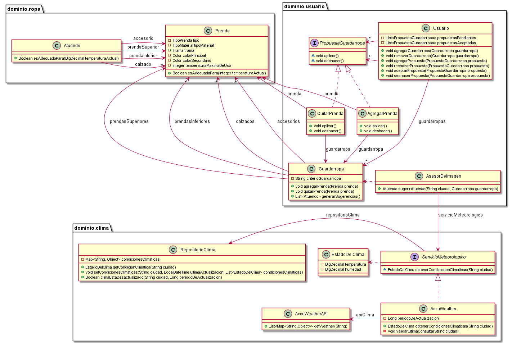

# QMP-Quinta-Iteracion

## Diagrama de clases - REQUERIMIENTOS DE ESTA ITERACION

<p align="center"> 

</p>

## Diagrama de clases - SOLUCION COMPLETA

<p align="center"> 

</p>

## Pseudocodigo

~~~

class Guardarropa {

  String criterioGuardarropa
  List<Prenda> prendas;
  
  agregarPrenda(Prenda prenda) {
    prendas.add(prenda)
  }
  
  quitarPrenda(Prenda prenda) {
    prendas.remove(prenda)
  }
}

Interface PropuestaGuardarropa {
    
    void aplicar()
    void deshacer()
}

class AgregarPrenda {

    Guardarropa guardarropa;
    Prenda prenda;

    public AgregarPrenda(Guardarropa guardarropa, Prenda prenda) {
    this.guardarropa = guardarropa;
    this.prenda = prenda;
    }
    
    void aplicar() {
        guardarropa.agregarPrenda(prenda)
    }
    
    void deshacer() {
        guardarropa.quitarPrenda(prenda)
    }
}

class QuitarPrenda {

    Guardarropa guardarropa;
    Prenda prenda;

    public QuitarPrenda(Guardarropa guardarropa, Prenda prenda) {
    this.guardarropa = guardarropa;
    this.prenda = prenda;
    }
    
    void aplicar() {
        guardarropa.quitarPrenda(prenda)
    }
    
    void deshacer() {
        guardarropa.agregarPrenda(prenda)
    }
}


class Usuario {

  List<Guardarropa> guardarropas;
  List<PropuestaGuardarropa> propuestasPendientes;
  List<PropuestaGuardarropa> propuestasAceptadas;
  
  public void agregarGuardarropa(Guardarropa guardarropa) {
    this.guardarropas.add(guardarropa);
  }

  public void removerGuardarropa(Guardarropa guardarropa) {
    this.guardarropas.remove(guardarropa);
  }

  public void agregarPropuesta(PropuestaGuardarropa propuesta) {
    propuestasPendientes.add(propuesta);
  }

  public void rechazarPropuesta(PropuestaGuardarropa propuesta) {
    propuestasPendientes.remove(propuesta);
  } // no valido que la "propuesta" este en "propuestas" -> confiar en el adentro
  // la "propuesta" seguramente se obtenga de un listado (en la UI) generado a partir de esta misma lista "propuestas"

  public void aceptarPropuesta(PropuestaGuardarropa propuesta) {
    propuesta.aplicar();
    this.propuestasPendientes.remove(propuesta);
    this.propuestasAceptadas.add(propuesta);
  }

  public void deshacerPropuesta(PropuestaGuardarropa propuesta) {
    propuesta.deshacer();
    this.propuestasAceptadas.remove(propuesta);
    this.propuestasPendientes.add(propuesta);
  }
}  

~~~

---


# Ejecutar tests

```
mvn test
```

# Validar el proyecto de forma exahustiva

```
mvn clean verify
```

Este comando hará lo siguiente:

 1. Ejecutará los tests
 2. Validará las convenciones de formato mediante checkstyle
 3. Detectará la presencia de (ciertos) code smells
 4. Validará la cobertura del proyecto

# Entrega del proyecto

Para entregar el proyecto, crear un tag llamado `entrega-final`. Es importante que antes de realizarlo se corra la validación
explicada en el punto anterior. Se recomienda hacerlo de la siguiente forma:

```
mvn clean verify && git tag entrega-final && git push origin HEAD --tags
```

