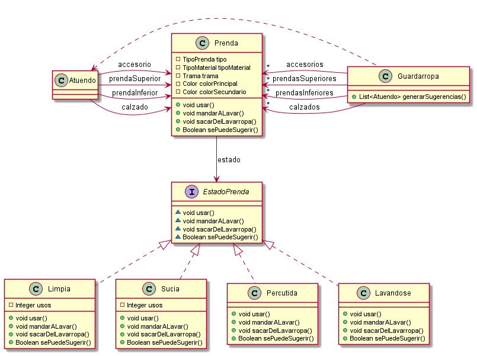

# QMP-Tercera-Iteracion-Opcional

## Diagrama de clases - REQUERIMIENTOS DE ESTA ITERACION

<p align="center"> 

</p>


## Pseudocodigo

~~~

class Atuendo {

  private Prenda prendaSuperior;
  private Prenda prendaInferior;
  private Prenda calzado;
  private Prenda accesorio;

  public Atuendo(Prenda prendaSuperior, Prenda prendaInferior, Prenda calzado, Prenda accesorio) {
    this.prendaSuperior = prendaSuperior;
    this.prendaInferior = prendaInferior;
    this.calzado = calzado;
    this.accesorio = accesorio;
  }

  public Prenda getPrendaSuperior() {
    return prendaSuperior;
  }

  public Prenda getPrendaInferior() {
    return prendaInferior;
  }

  public Prenda getCalzado() {
    return calzado;
  }

  public Prenda getAccesorio() {
    return accesorio;
  }
}

class Guardarropa {

  private Set<Prenda> prendasSuperiores;
  private Set<Prenda> prendasInferiores;
  private Set<Prenda> calzados;
  private Set<Prenda> accesorios;

  public List<Atuendo> generarSugerencias() {
    return Sets
        .cartesianProduct(prendasAptas(prendasSuperiores), prendasAptas(prendasInferiores), prendasAptas(calzados), prendasAptas(accesorios))
        .stream()
        .map((list) -> new Atuendo(list.get(0), list.get(1), list.get(2), list.get(3)))
        .collect(Collectors.toList());
  }

  private Set<Prenda> prendasAptas(Set<Prenda> prendas) {
    Set<Prenda> prendasAptas = prendas.stream()
        .filter(Prenda::sePuedeSugerir)
        .collect(Collectors.toSet());
    prendasAptas.forEach(Prenda::usar);
    return prendasAptas;
  }

}

interface EstadoPrenda {

  void usar();
  void mandarALavar();
  void sacarDelLavarropa();
  Boolean sePuedeSugerir();
}

class Limpia implements EstadoPrenda {
  private Integer usos = 0;
  private Prenda prenda;

  public Limpia(Prenda prenda) {
    this.prenda = prenda;
  }

  public void usar() {
    usos++;
    if(usos >= 2) prenda.setEstado(new Sucia(prenda));
  }

  public void mandarALavar() {
    prenda.setEstado(new Lavandose(prenda));
  }

  public void sacarDelLavarropa() {}

  public Boolean sePuedeSugerir() {
    return true;
  }
}

class Sucia implements EstadoPrenda {
  private Integer usos = 0;
  private Prenda prenda;

  public Sucia(Prenda prenda) {
    this.prenda = prenda;
  }

  public void usar() {
    usos++;
    if(usos >= 3) prenda.setEstado(new Percutida(prenda));
  }

  public void mandarALavar() {
    prenda.setEstado(new Lavandose(prenda));
  }

  public void sacarDelLavarropa() {}

  public Boolean sePuedeSugerir() {
    return true;
  }
}

class Percutida implements EstadoPrenda {
  private Prenda prenda;

  public Percutida(Prenda prenda) {
    this.prenda = prenda;
  }

  public void usar() {}

  public void mandarALavar() {}

  public void sacarDelLavarropa() {}

  public Boolean sePuedeSugerir() {
    return false;
  }
}

class Lavandose implements EstadoPrenda {
  private Prenda prenda;

  public Lavandose(Prenda prenda) {
    this.prenda = prenda;
  }

  public void usar() {}

  public void mandarALavar() {}

  public void sacarDelLavarropa() {
    prenda.setEstado(new Limpia(prenda));
  }

  public Boolean sePuedeSugerir() {
    return false;
  }
}

class Prenda {

  private TipoPrenda tipo;
  private TipoMaterial tipoMaterial;
  private Trama trama;
  private Color colorPrincipal;
  private Color colorSecundario;
  private EstadoPrenda estado;

  public Prenda(TipoPrenda tipo, TipoMaterial tipoMaterial, Trama trama, Color colorPrincipal, Color colorSecundario) {
    this.tipo = tipo;
    this.tipoMaterial = tipoMaterial;
    this.trama = trama;
    this.colorPrincipal = colorPrincipal;
    this.colorSecundario = colorSecundario;
    this.estado = new Limpia(this);
  }

  public Prenda usar() {
    estado.usar();
    return this;
  }

  public Prenda mandarALavar() {
    estado.mandarALavar();
    return this;
  }

  public Prenda sacarDelLavarropa() {
    estado.sacarDelLavarropa();
    return this;
  }

  public Boolean sePuedeSugerir() {
    return estado.sePuedeSugerir();
  }

  public void setEstado(EstadoPrenda estado) {
    this.estado = estado;
  }

}

~~~

---


# Ejecutar tests

```
mvn test
```

# Validar el proyecto de forma exahustiva

```
mvn clean verify
```

Este comando hará lo siguiente:

 1. Ejecutará los tests
 2. Validará las convenciones de formato mediante checkstyle
 3. Detectará la presencia de (ciertos) code smells
 4. Validará la cobertura del proyecto

# Entrega del proyecto

Para entregar el proyecto, crear un tag llamado `entrega-final`. Es importante que antes de realizarlo se corra la validación
explicada en el punto anterior. Se recomienda hacerlo de la siguiente forma:

```
mvn clean verify && git tag entrega-final && git push origin HEAD --tags
```

